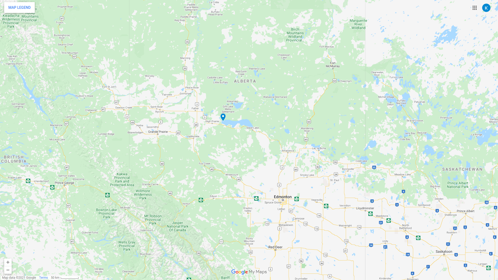

Join us for September 3, 2021 for the Captain and Kids Mini Tournament

- Prizes
- No entry fee

Competitive fishing event license 601553.

# Tournament Rules

- Each adult captain can take as many kids as his boat will allow.
- Each kid must register prior to going fishing kids must be 16 years or younger
- Registration is at the Golden weigh in building at 2 nd Marina from 10 A.M. to 11 A.M.
- Fishing is from 11:00A.M. to 3:00 P.M. Friday September 4 th . 2021
- There is no fee for entry
- Each kid may bring in one jack to be entered by measurement and then must be released
- Each boat must be equipped with a legal size live well to keep the fish alive for release
  after they are measured and must be inspected before going fishing
- It is mandatory that you use barbless hooks and kids must wear a lifejacket at all times
- Tournament boundaries are
  - East boundary are line from Shaws Creek to Driftpile Point
  - West boundary is the mouth of the Grouard channel
    -Everybody must follow all govt rules and regulations
- In the event of bad weather or winds over 30 K.P.H. the tournament will be cancelled
- Prizes will be awarded at 3:00 at end of fishing
- There will be free hamburgers and hot dogs for everybody

# Map and Directions

The tournament will be situated at [Shaw's Point Resort](https://www.shawspointresort.com/), near High Prairie, Alberta, Canada.

