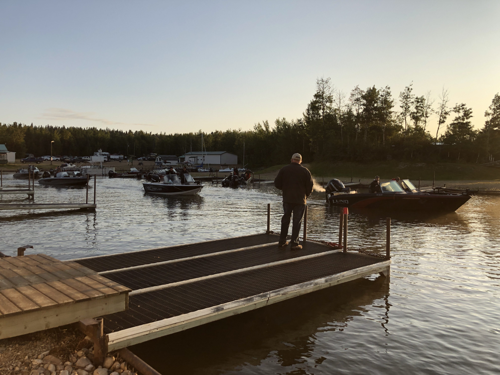
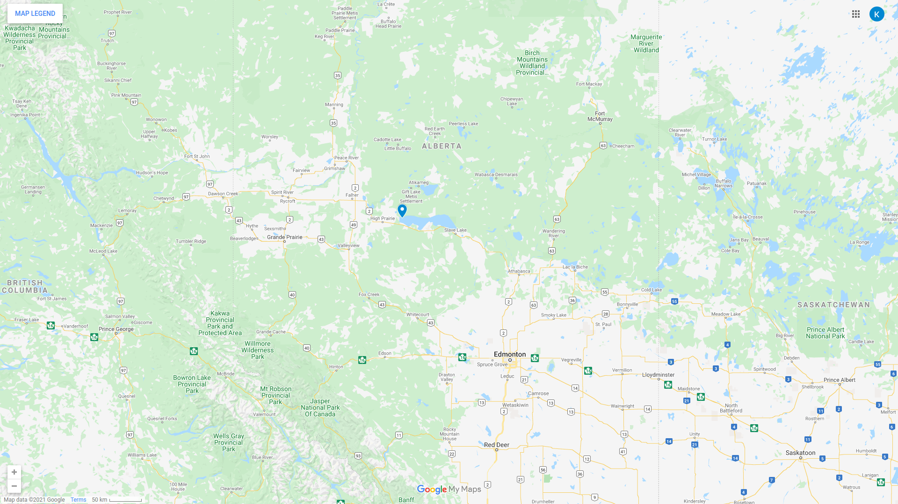

Join us for the 33rd. Anniversary Golden Walleye Classic fishing tournament on the Labour Day long weekend, September 4-5, 2021.

- $65,000 grand prize based on a 65 boat field
- $1000 entry fee
- Maximum 65 boats permitted
- 50/50 draws
- Silent auction

Competitive fishing event license 601551.

# Sponsors

The 2021 Golden Walleye Classic would like to extend our thank you to this years tournament sponsors.

- Revolution Auto Group
- Carwald Redi-Mix, Slave Lake Ltd.
- X-Cel Energy, High Prairie
- T J Logging Inc., Whitecourt
- Delorme Enterprises Ltd., High Prairie
- POP'S Home Hardware & Building Centre Inc, High Prairie
- Freson Bros., High Prairie
- Brayco Services, Grande Prairie
- Shaws Point Resort, High Prairie
- P2K Energy Services, Grande Prairie
- Powerstroke Well Control Ltd., Grande Prairie
- Flow Rite Energy, Grande Prairie

# Map and Directions

The tournament will be situated at [Shaw's Point Resort](https://www.shawspointresort.com/), near High Prairie, Alberta, Canada.

# Registration

Download the [registration form](/2021-registration.pdf).

# Tournament Rules

View or download the [tournament rules](/2021-rules).
